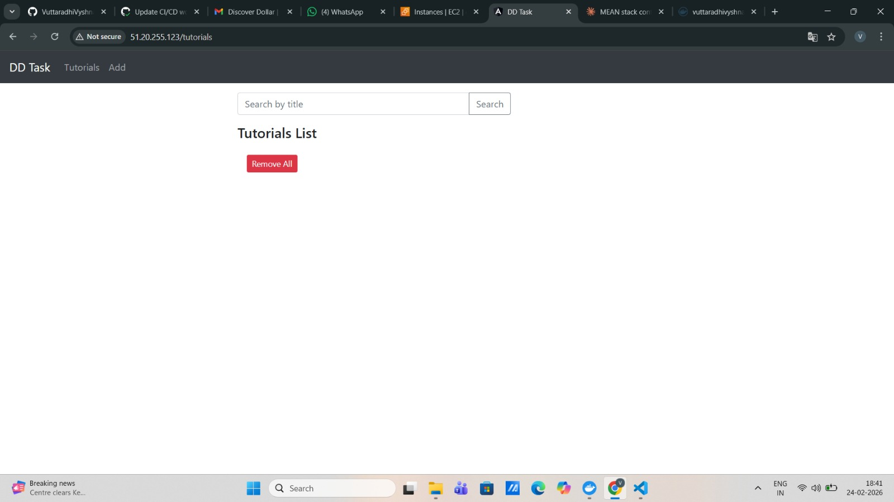
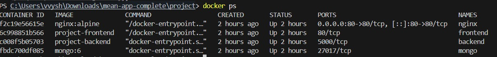

# MEAN Stack CRUD Application — DevOps Assignment

A full-stack CRUD application built with **MongoDB, Express, Angular, and Node.js**, fully containerized with Docker, deployed on Azure using Docker Compose, and automated with a GitHub Actions CI/CD pipeline.

🌐 **Live App:** http://51.20.255.123

📦 **Docker Hub:** https://hub.docker.com/u/vuttaradhivyshnavi

---

## Project Structure

```
.
├── backend/                        # Node.js + Express REST API
│   ├── app/
│   │   ├── config/db.config.js     # MongoDB connection (reads MONGO_URI env var)
│   │   ├── controllers/
│   │   ├── models/
│   │   └── routes/
│   ├── server.js
│   ├── package.json
│   ├── Dockerfile
│   └── .dockerignore
├── frontend/                       # Angular 15 SPA
│   ├── src/
│   ├── nginx.conf                  # Nginx config for Angular client-side routing
│   ├── Dockerfile                  # Multi-stage build
│   └── .dockerignore
├── nginx/
│   └── nginx.conf                  # Main reverse proxy config (port 80)
├── .github/
│   └── workflows/
│       └── ci-cd.yml               # GitHub Actions CI/CD pipeline
├── docker-compose.yml              # Local development (builds from source)
├── docker-compose.prod.yml         # Production (pulls images from Docker Hub)
└── README.md
```

---

## Architecture

```
                        ┌─────────────────────────────────┐
                        │         Azure Ubuntu VM          │
                        │         (51.20.255.123)          │
                        │                                  │
User ──── Port 80 ────► │  ┌─────────────────────────┐    │
                        │  │   Nginx Reverse Proxy    │    │
                        │  └────────┬────────┬────────┘    │
                        │           │        │             │
                        │    /api/* │        │ /*          │
                        │           ▼        ▼             │
                        │  ┌────────────┐ ┌────────────┐  │
                        │  │  Backend   │ │  Frontend  │  │
                        │  │ Node:5000  │ │ Nginx:80   │  │
                        │  └─────┬──────┘ └────────────┘  │
                        │        │                         │
                        │        ▼                         │
                        │  ┌────────────┐                  │
                        │  │  MongoDB   │                  │
                        │  │  :27017    │                  │
                        │  └────────────┘                  │
                        └─────────────────────────────────┘
```

All 4 services run in Docker containers on a shared `app-network` bridge network.
MongoDB data is persisted via a named Docker volume (`mongo-data`).

---

## Prerequisites

- Docker and Docker Compose
- Git
- Docker Hub account
- Ubuntu VM (Azure/AWS/GCP)

---

## Local Development Setup

### 1. Clone the Repository

```bash
git clone https://github.com/VuttaradhiVyshnavi/mean-crud-devops.git
cd mean-crud-devops
```

### 2. Build and Run with Docker Compose

```bash
docker compose up --build
```

### 3. Access the Application

Open: **http://localhost**

- `http://localhost/` → Angular frontend
- `http://localhost/api/tutorials` → Backend API

---

## VM Deployment (Ubuntu on Azure)

### Step 1: Provision Ubuntu 22.04 VM

- Launch Ubuntu 22.04 VM on Azure
- Open **port 80** in the Network Security Group (inbound rule)
- Note the public IP address

### Step 2: Install Docker on the VM

```bash
sudo apt update && sudo apt upgrade -y

# Install Docker
curl -fsSL https://get.docker.com -o get-docker.sh
sudo sh get-docker.sh

# Add user to docker group
sudo usermod -aG docker $USER
newgrp docker

# Verify
docker --version
docker compose version
```

### Step 3: Clone Repo and Deploy

```bash
git clone https://github.com/VuttaradhiVyshnavi/mean-crud-devops.git
cd mean-crud-devops

export DOCKER_USERNAME=vuttaradhivyshnavi
docker compose -f docker-compose.prod.yml up -d
```

### Step 4: Verify All Containers Are Running

```bash
docker ps
```

You should see 4 containers: `nginx`, `frontend`, `backend`, `mongo`

---

## Docker Images

### Build Locally

```bash
docker build -t vuttaradhivyshnavi/mean-backend:latest ./backend
docker build -t vuttaradhivyshnavi/mean-frontend:latest ./frontend
```

### Push to Docker Hub

```bash
docker login
docker push vuttaradhivyshnavi/mean-backend:latest
docker push vuttaradhivyshnavi/mean-frontend:latest
```

### Pull from Docker Hub

```bash
docker pull vuttaradhivyshnavi/mean-backend:latest
docker pull vuttaradhivyshnavi/mean-frontend:latest
```

---

## CI/CD Pipeline — GitHub Actions

The pipeline is defined in `.github/workflows/ci-cd.yml` and **automatically triggers on every push to `main`**.

### Pipeline Flow

```
Push to main branch
        │
        ▼
┌─────────────────────────────────────┐
│     Job 1: Build & Push (1m 46s)    │
│                                     │
│  ✅ Checkout Code                   │
│  ✅ Login to Docker Hub             │
│  ✅ Set up Docker Buildx            │
│  ✅ Build & Push backend:latest     │
│  ✅ Build & Push frontend:latest    │
└──────────────────┬──────────────────┘
                   │
                   ▼
┌─────────────────────────────────────┐
│       Job 2: Deploy to VM (1m 27s)  │
│                                     │
│  ✅ Checkout Code                   │
│  ✅ Copy compose files to VM (SCP)  │
│  ✅ SSH into VM                     │
│  ✅ Pull latest images              │
│  ✅ docker compose down             │
│  ✅ docker compose up -d            │
│  ✅ Prune old images                │
└─────────────────────────────────────┘
```

### GitHub Secrets Required

| Secret | Description |
|--------|-------------|
| `DOCKER_PASSWORD` | Docker Hub access token (Read & Write) |
| `VM_HOST` | Azure VM public IP |
| `VM_USER` | SSH username (`azureuser`) |
| `VM_SSH_KEY` | Private SSH key contents |

---

## Nginx Reverse Proxy

### Main Nginx (`nginx/nginx.conf`)
Single entry point on **port 80**:
- `/api/*` → proxied to backend container (port 5000)
- `/*` → proxied to frontend container (port 80)

### Frontend Nginx (`frontend/nginx.conf`)
Handles Angular client-side routing:
- All paths redirect to `index.html` so Angular Router works correctly

---

## Environment Variables

| Variable | Service | Value | Description |
|----------|---------|-------|-------------|
| `PORT` | Backend | `5000` | Node.js server port |
| `MONGO_URI` | Backend | `mongodb://mongodb:27017/dd_db` | MongoDB connection URL |

---

## Screenshots

### 1. CI/CD Pipeline — GitHub Actions (Both Jobs Green)


### 2. Docker Image Build and Push Process


### 3. Application Deployment — Working UI


### 4. Nginx Setup — All Containers Running


---

## Stopping the Application

```bash
# Stop containers (keeps MongoDB data)
docker compose down

# Stop and remove all data including MongoDB volume
docker compose down -v
```

---

## Key Design Decisions

- **Port consistency** — Backend runs on port 5000 in Dockerfile, server.js, and docker-compose
- **Relative API URL** — Frontend uses `/api/tutorials` so Nginx handles routing without hardcoded IPs
- **Multi-stage frontend build** — Angular compiled in Node stage; only static files served by Nginx (smaller image ~50MB vs ~1GB)
- **Named Docker network** — All services resolve each other by container name (`mongodb`, `backend`, `frontend`)
- **MongoDB volume** — Data persists across container restarts via named volume `mongo-data`
- **Production compose** — Separate `docker-compose.prod.yml` pulls pre-built images from Docker Hub instead of building on VM
